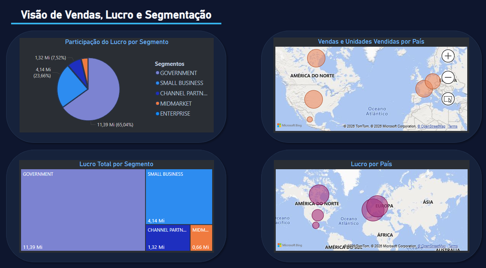

  

  Dashboard desenvolvido em <b>Power BI</b> com foco em <b>análise de vendas</b>, <b>lucro</b>, <b>unidades vendidas</b> e <b>segmentação por país</b>, com visual moderno em tema escuro e identidade em tons amarelos para destacar os indicadores.

  
  
  
  
  

---

## `> overview`

Este projeto apresenta um <b>dashboard em Power BI</b> desenvolvido para analisar o desempenho comercial com base em <b>vendas</b>, <b>lucro</b>, <b>unidades vendidas</b> e <b>segmentação por país</b>.

A proposta foi transformar dados em uma visualização clara, objetiva e visualmente mais atrativa, com foco em leitura rápida dos principais indicadores de negócio.

---

## `> dashboard_focus`

O relatório foi construído para destacar métricas como:

- vendas por país
- unidades vendidas por país
- lucro por país
- participação do lucro por segmento
- distribuição de lucro por segmento

---

## `> visuals_created`

Os principais visuais desenvolvidos foram:

- gráfico de pizza para participação do lucro por segmento
- mapa geográfico para vendas e unidades vendidas por país
- mapa geográfico para lucro por país
- treemap para lucro total por segmento

---

## `> visual_style`

O dashboard foi personalizado com foco em uma apresentação mais moderna e profissional, utilizando:

- tema escuro
- destaques em amarelo
- layout mais limpo
- cards visuais
- melhor organização dos elementos
- identidade visual mais forte para portfólio

---

## `> project_structure`

    dashboard-financeiro-power-bi
    │
    ├── BI/
    │   └── Relatorio_financial.pbix
    │
    ├── images/
    │   └── Dashboard.png
    │
    └── README.md

---

## `> preview`

  

---

## `> skills_applied`

- Power BI
- visualização de dados
- construção de dashboards
- análise de indicadores
- organização de layout
- storytelling visual
- apresentação de dados para negócio

---

## `> project_goal`

O objetivo deste projeto foi praticar a criação de dashboards no <b>Power BI</b>, unindo análise de dados, organização visual e apresentação executiva das informações para gerar um material mais forte de estudo e portfólio.

---

## `> author`

**Christopher Benini**

  

